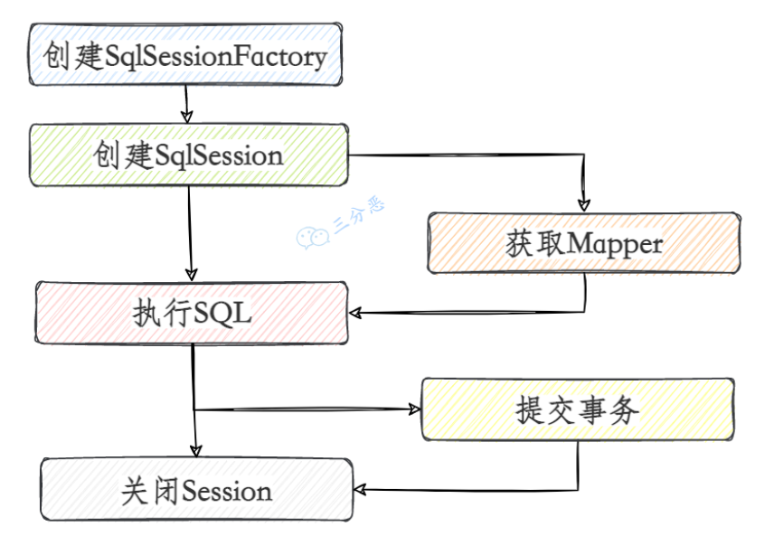
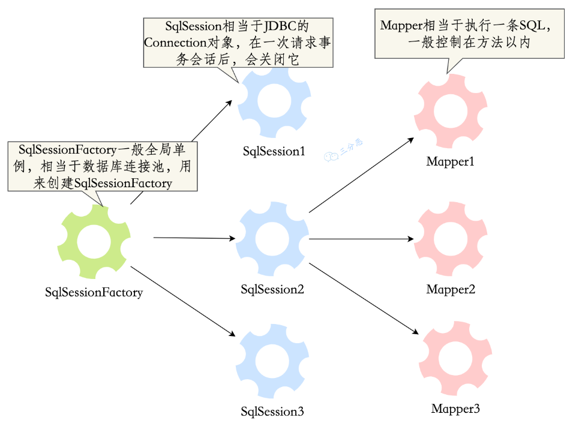

# Mybatis

## Mybatis

### 基础

#### 传参方式

- 顺序传参

  ~~~java
  public User selectUser(String name, int deptId);
  
  <select id="selectUser" resultMap="UserResultMap">
      select * from user
      where user_name = #{0} and dept_id = #{1}
  </select>
  ~~~

- @Param注解传参法

  ~~~java
  public User selectUser(@Param("userName") String name, int @Param("deptId") deptId);
  
  <select id="selectUser" resultMap="UserResultMap">
      select * from user
      where user_name = #{userName} and dept_id = #{deptId}
  </select>
  ~~~

- Map传参法

  ~~~java
  public User selectUser(Map<String, Object> params);
  
  <select id="selectUser" parameterType="java.util.Map" resultMap="UserResultMap">
      select * from user
      where user_name = #{userName} and dept_id = #{deptId}
  </select>
  ~~~

- Java Bean传参法

  ~~~java
  public User selectUser(User user);
  
  <select id="selectUser" parameterType="com.jourwon.pojo.User" resultMap="UserResultMap">
      select * from user
      where user_name = #{userName} and dept_id = #{deptId}
  </select>
  ~~~

  

### 生命周期

上面提到了几个MyBatis的组件，一般说的MyBatis生命周期就是这些组件的生命周期。

- SqlSessionFactoryBuilder
  一旦创建了 SqlSessionFactory，就不再需要它了。 因此 SqlSessionFactoryBuilder 实例的生命周期只存在于方法的内部。

- SqlSessionFactory
  SqlSessionFactory 是用来创建SqlSession的，相当于一个数据库连接池，每次创建SqlSessionFactory都会使用数据库资源，多次创建和销毁是对资源的浪费。所以SqlSessionFactory是应用级的生命周期，而且应该是单例的。

- SqlSession
  SqlSession相当于JDBC中的Connection，SqlSession 的实例不是线程安全的，因此是不能被共享的，所以它的最佳的生命周期是一次请求或一个方法。

- Mapper
  映射器是一些绑定映射语句的接口。映射器接口的实例是从 SqlSession 中获得的，它的生命周期在sqlsession事务方法之内，一般会控制在方法级。

## Mybatis - Plus

### 代码生成器

~~~java
    /**
     * mybatis-Plus 反向代码生成
     *
     * @param args
     */
    public static void main(String[] args) {
        // 下面代码事直接从mybatis-Plus官网粘贴的
        // 相比官网追加了 spring-boot-starter-freemarker 依赖
        FastAutoGenerator.create("jdbc:mysql://localhost:3306/oa?autoReconnect=true&useUnicode=true&createDatabaseIfNotExist=true&characterEncoding=utf8&useSSL=true&serverTimezone=UTC", "vincent", "vincent")
                .globalConfig(builder -> {
                    builder.author("孟子铭") // 设置作者
                            //.enableSwagger() // 开启 swagger 模式
                            //.fileOverride() // 覆盖已生成文件
                            .outputDir("D:\\github\\mybatisPlus_demo\\src\\main\\java"); // 指定输出目录
                })
                .dataSourceConfig(builder -> builder.typeConvertHandler(
                        (globalConfig, typeRegistry, metaInfo) -> {
                            int typeCode = metaInfo.getJdbcType().TYPE_CODE;
                            if (typeCode == Types.SMALLINT)// 自定义类型转换
                                return DbColumnType.INTEGER;
                            return typeRegistry.getColumnType(metaInfo);
                        }))
                .packageConfig(builder -> {
                    builder.parent("cn.vincent") // 设置父包名
                            //.moduleName("entity") // 设置父包模块名
                            .pathInfo(Collections.singletonMap(OutputFile.xml, "D:\\github\\mybatisPlus_demo\\src\\main\\resources\\mapper")); // 设置mapperXml生成路径
                })
                .strategyConfig(builder -> {
                    builder.addInclude("order_1") // 设置需要生成的表名
                            .addTableSuffix("_1")
                            .addTablePrefix("t_", "c_"); // 设置过滤表前缀
                })
                .templateEngine(new FreemarkerTemplateEngine()) // 使用Freemarker引擎模板，默认的是Velocity引擎模板
                .execute();
    }
~~~

所需依赖

~~~xml
        <dependency>
            <groupId>org.springframework.boot</groupId>
            <artifactId>spring-boot-starter-freemarker</artifactId>
        </dependency>

        <dependency>
            <groupId>mysql</groupId>
            <artifactId>mysql-connector-java</artifactId>
        </dependency>

        <dependency>
            <groupId>com.baomidou</groupId>
            <artifactId>mybatis-plus-boot-starter</artifactId>
            <version>3.5.3.1</version>
        </dependency>

        <dependency>
            <groupId>com.baomidou</groupId>
            <artifactId>mybatis-plus-generator</artifactId>
            <version>3.5.3.1</version>
        </dependency>
~~~

### CURD 接口

### 条件构造器

### 主键策略

### 扩展功能

#### 分页插件

~~~java
@Bean
public MybatisPlusInterceptor mybatisPlusInterceptor() {
    MybatisPlusInterceptor interceptor = new MybatisPlusInterceptor();
    interceptor.addInnerInterceptor(new PaginationInnerInterceptor(DbType.H2));
    return interceptor;
}
~~~

#### 逻辑删除

#### 通用枚举

#### 字段类型处理

#### 自动填充

~~~java
public class MybatisPlusHandler implements MetaObjectHandler {
    //注意！ 需要自动填充字段 需要标记fill属性
    //@TableField(.. fill = FieldFill.INSERT)
    //private String fillField;

    @Override
    public void insertFill(MetaObject metaObject) {
        log.info("数据插入前 注入 ....");
        this.strictInsertFill(metaObject, "userPwd", String.class, "123");
        this.strictInsertFill(metaObject, "updateTime", LocalDateTime.class, LocalDateTime.now());
    }

    @Override
    public void updateFill(MetaObject metaObject) {
        log.info("数据更新前 注入 ....");
        this.strictInsertFill(metaObject, "updateTime", LocalDateTime.class, LocalDateTime.now());
    }
}
~~~

